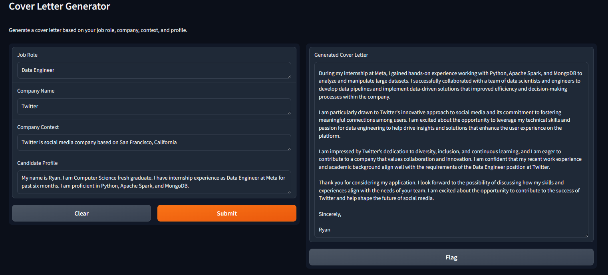

# Cover Letter Generator
Introducing the Cover Letter Generator—an AI-powered tool using LangChain and Gradio. It creates personalized cover letters quickly and effectively. Input your job role, company details, and profile information, and let AI generate tailored cover letters instantly. Customize style and tone effortlessly for professional, compelling applications.



## Getting Started

These instructions will help you set up the project locally on your machine.

### Prerequisites

To run this application, you will need to have:

- A Python environment running Python 3.6 or newer.
- An OpenAI API Key (stored in local environment).
- Required libraries (LangChain, Gradio, etc.).

### Installation

1. Clone this repository with the command:

    ```bash
    git clone https://github.com/anaquib1110/project_on_cover-letter-gen/tree/main
    ```

2. Install the required libraries with the command:

    ```bash
    pip install -r requirements.txt
    ```
    You can use python package manager such as venv or conda (it's your choice). In here, i use CPU to run the program, if you want to use GPU, install faiss-gpu instead.
   
3. Run the application with the command:

    ```bash
    python app.py
    ```

## Update

- Candidate profile input changed to user CV PDF file (RAG feature).
- Changed to GROQ API Key (faster and free).

## Usage

Fill in the required fields:

1. Input your target job role, e.g., `Software Engineer`.
2. Input the company's name, e.g., `Google Inc.`
3. Provide a brief detail about the target company, e.g., `A multinational tech company specializing in internet-related products and services.`
4. Changed to using PDF file RAG which is should be our resume (ATS) as candidate profile for better cover letter generation and effective generative (less writing!)